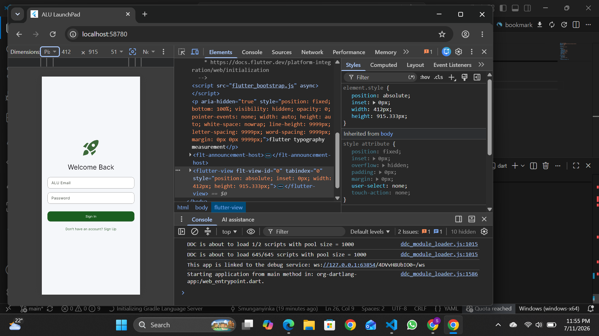
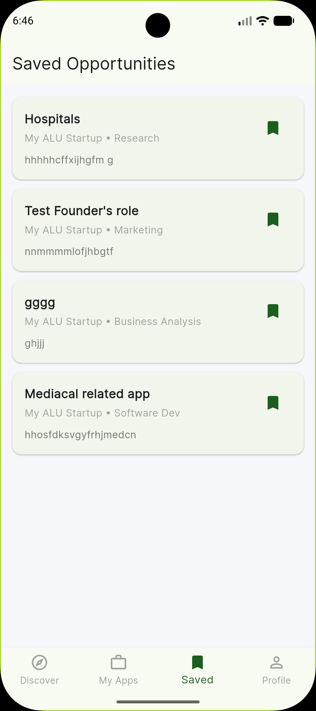
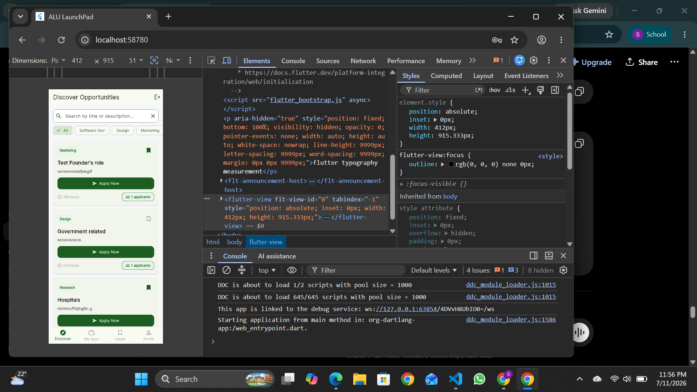
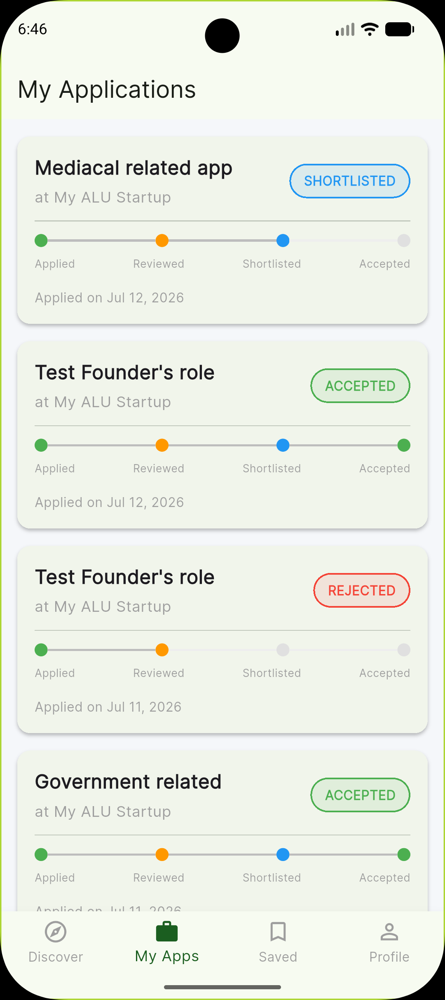
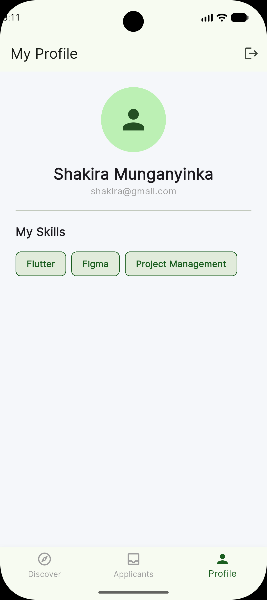

# ALU LaunchPad

A mobile application connecting ALU students seeking internship experience with student-led startups and early-stage ventures within the ALU ecosystem.

---

## Problem & Solution

Many ALU students struggle to secure traditional internships, while student entrepreneurs lack accessible, affordable talent. **LaunchPad** bridges this gap by providing a trusted, real-time platform for micro-internships specifically designed for the ALU community.

---

##  Tech Stack

- **Framework:** Flutter 3.x
- **Language:** Dart
- **State Management:** BLoC & Cubit (`flutter_bloc`)
- **Architecture:** Clean Architecture (Presentation, Domain, Data)
- **Backend:** Firebase Authentication & Cloud Firestore
- **Dependency Injection:** `get_it`
- **Routing:** `go_router`

---

## Architecture

The application follows **Clean Architecture** to promote scalability, maintainability, and testability.

### Presentation Layer
- Flutter UI widgets
- BLoCs/Cubits for state management
- Handles user interactions and presentation logic

### Domain Layer
- Business logic
- Entities
- Use Cases
- Independent of Flutter and Firebase

### Data Layer
- Repository implementations
- Firebase Authentication
- Cloud Firestore data sources
- Converts Firebase data into domain entities

This architecture ensures that the business logic remains independent of the backend implementation, making it easy to switch data sources in the future.

---

##  Features

### Authentication
- User registration and login
- Firebase Authentication
- Role-based authentication

### Role-Based Access
- Dynamic interface for Students and Founders
- Student workflow:
  - Discover opportunities
  - Apply for internships
  - Track applications
- Founder workflow:
  - Create internship opportunities
  - Manage applications
  - View applicants

### Startup Verification
- Founders must be verified before posting opportunities
- Prevents spam and fake startup listings

### Smart Navigation
- Dynamic bottom navigation
- Icons and labels change depending on user role

### Internship Discovery
- Browse available internships
- Search opportunities
- Filter opportunities locally using BLoC

### Bookmarks
- Save favorite opportunities
- Optimistic UI updates for instant feedback

### Applications
- Apply for internships
- Real-time application updates
- Visual application status tracking

### Real-Time Updates
- Firestore snapshot listeners
- Automatic synchronization of application status

---

##  Getting Started

### Prerequisites

Before running the project, ensure you have:

- Flutter SDK (>=3.0.0 <4.0.0)
- Android Studio or VS Code
- Firebase Project

---

## Installation

### 1. Clone the repository

```bash
git clone https://github.com/SMunganyinka/alu_launchpad.git
cd alu_launchpad
```

### 2. Install dependencies

```bash
flutter pub get
```

### 3. Configure Firebase

1. Create a project in the Firebase Console.
2. Add an Android application.
3. Download the `google-services.json` file.
4. Place it in:

```
android/app/google-services.json
```

5. Enable:

- Email/Password Authentication
- Cloud Firestore
- Firebase Storage

### 4. Run the application

```bash
flutter run
```

---

##  Project Structure

```
lib/
├── core/
│   ├── constants/
│   ├── themes/
│   ├── widgets/
│   └── utils/
│
├── features/
│   ├── auth/
│   ├── opportunity/
│   ├── application/
│   ├── bookmark/
│   ├── chat/
│   └── profile/
│
└── main.dart
```

---

##  Screenshots


### Login Screen



### Home Screen



### Discover Opportunities



### Applications



### Profile


```

---

##  Deliverables

This project includes:

- Flutter source code
- Technical report (PDF)
- Demonstration video (7–10 minutes)

---

##  Author

**Shakira Munganyinka**

African Leadership University (ALU)

---

##  License

This project was developed as part of an academic assignment for the African Leadership University (ALU). It is intended for educational purposes only.